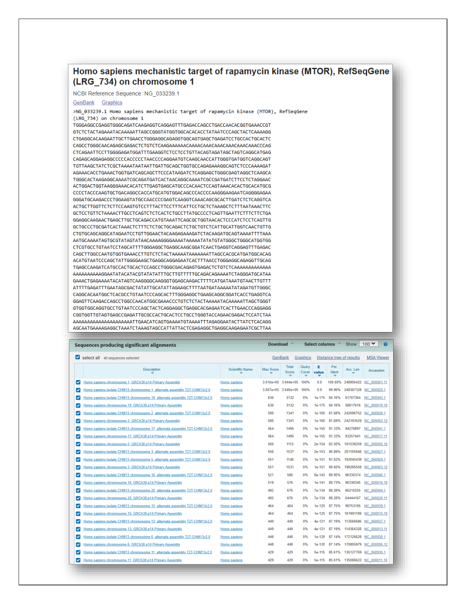
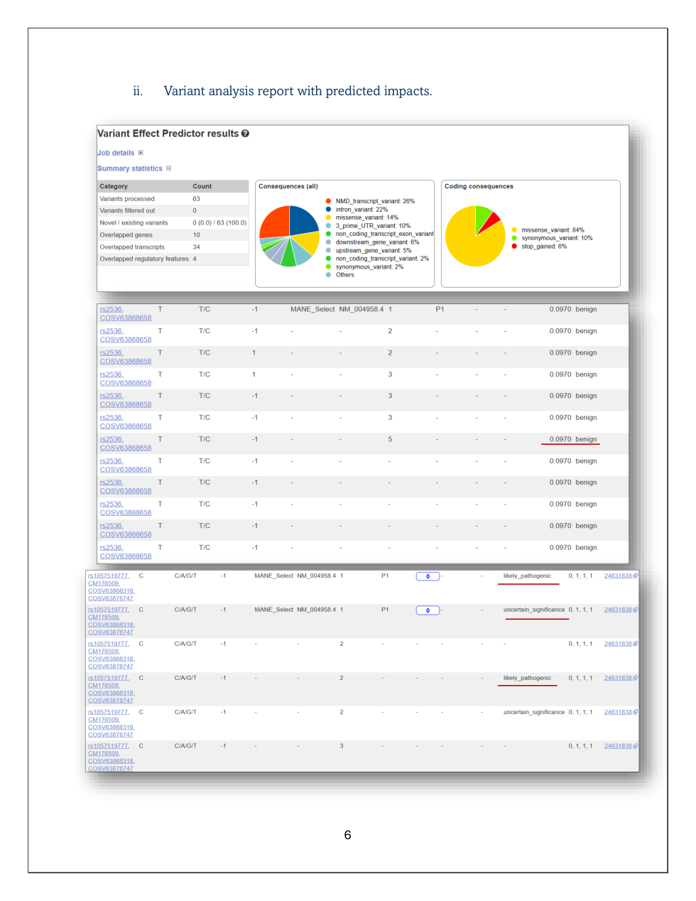
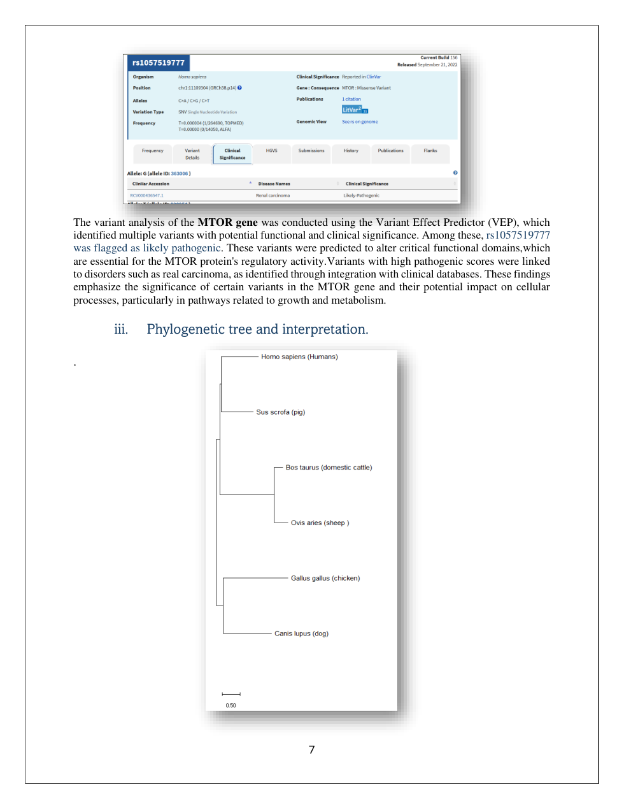
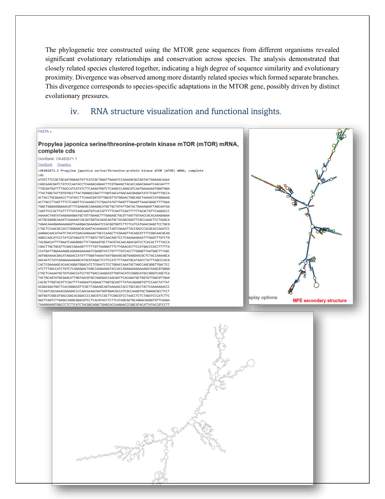
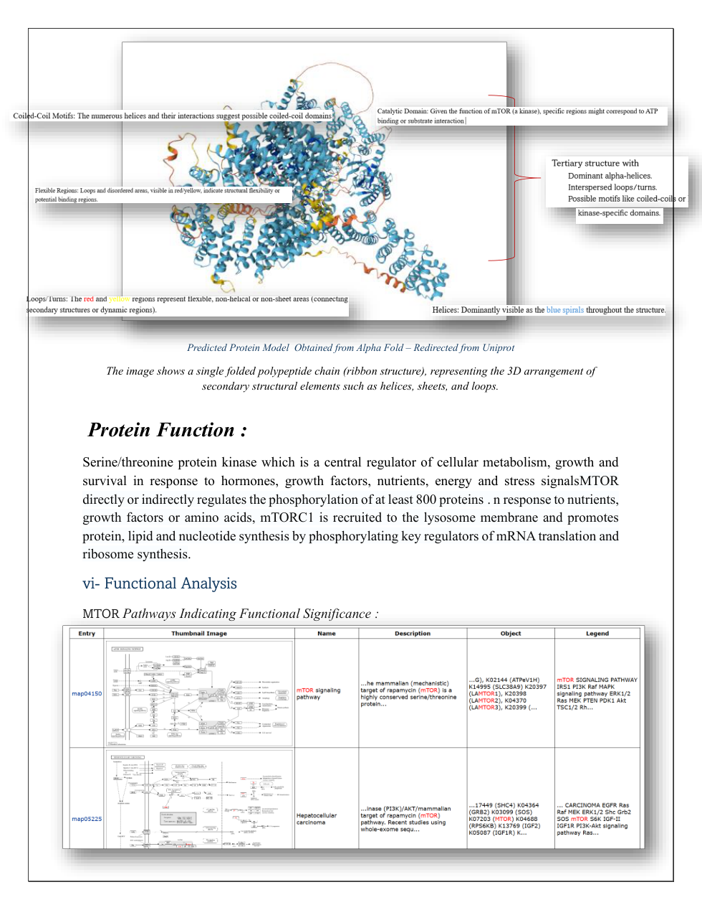
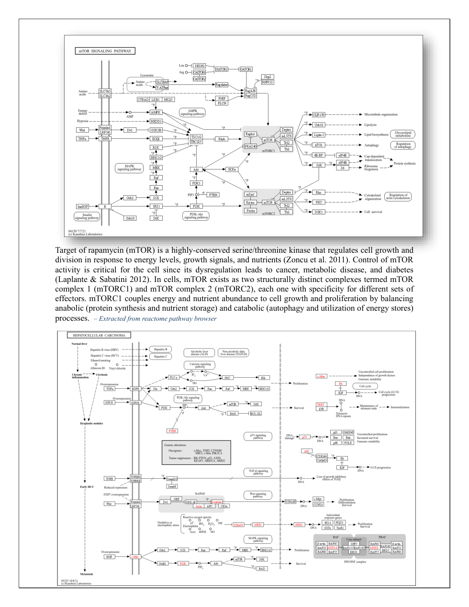

# MTOR — Sequence-to-Structure Bioinformatics Analysis

A multi-layered bioinformatics analysis of the human **MTOR** gene integrating sequence information, genetic variation, evolutionary context, RNA/protein structure, and biological pathways.

## Project overview

The goal of this project was to follow one biologically important gene across multiple levels of analysis and connect information from public bioinformatics resources into a coherent interpretation.

**Gene studied:** MTOR  
**NCBI Gene ID:** 2475  

## Analysis workflow

```text
MTOR gene identification
        ↓
NCBI / Ensembl sequence and annotation
        ↓
BLAST homology exploration
        ↓
variant-effect interpretation with Ensembl VEP
        ↓
cross-species multiple-sequence alignment and phylogeny
        ↓
RNA secondary-structure exploration
        ↓
protein structure resources
        ↓
pathway and functional interpretation
```

The original analysis used resources and tools including **NCBI Gene, Ensembl, BLAST, Ensembl VEP, MEGA, RNAfold, SWISS-MODEL, AlphaFold, KEGG, and Reactome**.

## What this repository contains

- a concise record of the original MTOR analysis and its scope
- a script to retrieve the current public NCBI Gene record for MTOR
- a script to query current Ensembl variation information
- a Biopython script for basic FASTA sequence statistics
- documentation explaining the biological questions and limitations of the analysis

The scripts are supporting utilities for the public GitHub version. The original coursework itself was primarily completed through database/web-tool analysis and documented in a report.

## Example commands

Create and activate a virtual environment:

```bash
python3 -m venv .venv
source .venv/bin/activate
pip install -r requirements.txt
```

Retrieve the current NCBI Gene record for MTOR:

```bash
python scripts/fetch_mtor_ncbi.py
```

Look up the variant discussed in the coursework:

```bash
python scripts/ensembl_variant_lookup.py rs1057519777
```

Calculate simple statistics for a FASTA sequence:

```bash
python scripts/sequence_stats.py path/to/sequence.fasta
```

> The NCBI and Ensembl scripts require internet access. Database records and annotations can change over time.

## Biological questions explored

The project considered questions such as:

- What sequence and annotation information is available for human MTOR?
- How can homologous sequences help provide evolutionary context?
- What can public variant-annotation tools tell us about reported MTOR variants?
- What do RNA and protein-structure resources contribute to sequence-to-function interpretation?
- Which pathways and biological processes are associated with MTOR?

## Skills demonstrated

- Bioinformatics analysis
- Biological database navigation and interpretation
- NCBI and Ensembl resources
- Sequence retrieval and FASTA handling
- BLAST and homology-analysis concepts
- Variant interpretation / VEP concepts
- Multiple-sequence alignment and phylogenetic analysis
- RNA secondary-structure analysis
- Protein structure resources, including AlphaFold and SWISS-MODEL
- KEGG and Reactome pathway interpretation
- Python and Biopython
- Scientific interpretation and communication

## Project background

This project originated as a **BIO310 undergraduate bioinformatics case study** titled *Comprehensive Bioinformatics Analysis of a Gene: From Sequence to Structure*.

The original submission was largely report- and web-tool-based. For this GitHub version, the work has been organized into a clearer public repository, and a few small scripts were added to make selected database-retrieval and sequence-statistics steps easier to rerun.

Historical screenshots or machine-readable outputs that were not preserved are **not recreated or presented as original results**. See [`docs/PROJECT_BACKGROUND.md`](docs/PROJECT_BACKGROUND.md) for additional context.

## Scientific limitations

- Public database records and variant annotations can change as evidence is updated.
- Some stages of the original analysis used interactive web tools, so exact historical tool/database versions were not preserved.
- This is an undergraduate bioinformatics case study, not a clinical interpretation pipeline.
- Predicted or database-reported variant effects should not be treated as proof of clinical causality.

## Selected results

The original analysis report contains the main project outputs. Selected figures are included here so the repository shows the actual analytical evidence rather than only code and documentation.

### BLAST and sequence analysis


The MTOR reference sequence was examined with NCBI/BLAST to identify significant sequence matches and conserved regions.

### Variant analysis


Ensembl VEP was used to inspect candidate MTOR variants and their predicted consequences. Because public database annotations change over time, historical screenshots are presented as part of the original analysis; the included Ensembl lookup script can be used to query current annotations.

### Phylogenetic analysis


MTOR sequences from multiple species were compared to examine evolutionary relationships and conservation.

### RNA secondary structure


RNAfold was used to examine predicted secondary-structure features in an MTOR-related transcript sequence.

### Protein structure


Protein-level analysis included structural interpretation using AlphaFold/UniProt-linked structural information and related modelling resources.

### Pathway analysis


KEGG and Reactome were used to place MTOR in broader signalling and disease-related pathway context.


## Repository structure

```text
MTOR-Sequence-to-Structure-Analysis/
├── README.md
├── requirements.txt
├── scripts/
│   ├── fetch_mtor_ncbi.py
│   ├── ensembl_variant_lookup.py
│   └── sequence_stats.py
├── docs/
│   └── PROJECT_BACKGROUND.md
├── data/
│   └── README.md
└── results/
```
